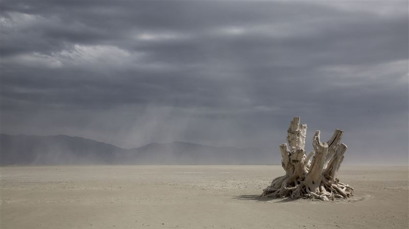

--- 
title: "Investigating industrial sources of heavy metal pollution to the Great Salt Lake playa"
author: "Molly Blakowski"
date: '`r Sys.Date()`'
bibliography:
- book.bib
- packages.bib
description: This is a minimal example of using the bookdown package to write a book.
  The output format for this example is bookdown::gitbook.
documentclass: book
link-citations: yes
site: bookdown::bookdown_site
biblio-style: apalike
---

# Introduction

This project is related to the first chapter of my dissertation, for which I am attempting to use a novel geochemical tracer - Thallium stable isotopes - to apportion the sources of heavy metals to the dry lakebed (playa) of the Great Salt Lake.

## Project goals

The goals of my WILD 6900 project are to:

1. Clean data received from my collaborator who conducted the first round of geochemical analayses
2. Plot my data to quickly share with my collaborators and plan our next steps
3. Create a database that can facilitate quick comparison of multiple data types from this study and other Tl isotope studies

## Project outline

This book is composed of the following chapters:

* Chapter 1: [Introduction]
* Chapter 2: [Cleaning raw data with tidyverse]
* Chapter 3: [Plotting data with ggplot]
* Chapter 4: [Creating a database in SQLite]


## Project background

The Great Salt Lake (GSL) is the largest saline lake in the Western Hemisphere and the eighth largest inland body of saltwater in the world. In 2019, the economic value of the GSL from mineral extraction, commercial brine shrimp harvest, and recreation was estimated at $1.5 billion US dollars (Bioeconomics, 2012). The GSL also provides food and shelter to millions of migratory birds flying between North and South America on the Pacific and Central Flyways. Over the years, a series of droughts and wet cycles have led to major fluctuations in lake level. These fluctuations have made it harder to detect anthropogenic impacts to the lake (Null & Wurtsbaugh, 2020; Wurtsbaugh et al., 2017). However, recent research revealed that there have been no significant long-term changes in precipitation or streamflow from the GSL tributaries since the first white settlers arrived in 1847 (Wurtsbaugh et al., 2017). What has changed is water use: humans have reduced flows into the lake by about 39%, lowering the lake by 3.4 m and reducing lake area by 50% (Wurtsbaugh et al., 2017). The decline of the GSL has exposed a huge supply of fine-grained sediments to erosion and entrainment in the atmosphere (Perry et al., 2019; Wurtsbaugh et al., 2017). Dr. Kevin Perry’s recent GSL dust plume investigation study revealed that surface sediments across the GSL playa are contaminated by anthropogenic heavy metals (Perry et al., 2019). Due to its proximity to urban and industrial centers, the playa near Farmington Bay (FB), which is the bay that occupies the southeastern portion of the lake, exhibits particularly high concentrations of heavy metals, such as Cd, Pb, and Zn (Perry et al., 2019). Identifying the sources of heavy metal pollution to this growing dust source will provide valuable data for policymakers to formulate strategies for dust and pollution mitigation.

```{r dust-fig, echo = FALSE, fig.align = "left", fig.cap = "Photo of a dust storm on the GSL playa.", out.width = '80%'}



```

The GSL is a terminal lake that accumulates pollution from mining, smelting, mineral extraction, weapons testing, agriculture, and municipal and industrial wastewater across its entire watershed. Thus, although there are many “suspects” to consider in this investigation, mining and smelting are likely the most prominent sources of atmospheric pollution near the GSL. The neighboring Oquirrh and Wasatch Mountains have been mined for Ag, Au, Cu, and Pb since the late 1800s and early 1900s. Moreover, the smelter and tailings impoundment for the Kennecott Copper Mine, one of the largest open-pit mines in the world, are located on the southern shore of the GSL, directly upwind from FB. Dust plumes are frequently observed originating from the Kennecott tailings, as well as other waste piles in the Bingham Mining District. As a result, the southeastern portion of the playa is enriched in a suite of heavy metals, often with gradually lower concentrations moving farther away from Kennecott (Perry et al., 2019). However, a large portion of the playa is periodically flooded with water from polluted waterways, representing another potentially significant source of heavy metal pollution. Effluent from nine wastewater treatment plants flows from the Jordan River through Salt Lake City to FB and the surrounding wetlands (Kelso & Baker, 2020). This area also receives wastewater from industrial drainage canals, including the Goggin Drain and the Sewage Canal, the latter of which is a former EPA Superfund Site that was never fully remediated (Waddell et al., 2009; Wurtsbaugh et al., 2012). Utah Lake, which drains into the GSL via the Jordan River, as well as the river itself are also polluted by runoff from Provo, Salt Lake City, and smaller cities in between.  

I will attempt to attribute heavy metals in GSL playa dust to mine waste, smelting, and riverine sources through receptor modeling and isotope fingerprinting. Recent advances in mass spectrometry have made it possible to measure small variations in the stable isotope compositions of toxic trace metals like thallium (Tl) in environmental samples (Weiss et al., 2008), but at present, the differences in ^205^Tl/^203^Tl (hereafter noted as \(\epsilon\)^205^Tl) have only been measured in a limited number of Tl pollution scenarios. Thus, further investigations using Tl isotopes as potential tracers are warranted (Kersten et al., 2014; Liu et al., 2020; Vaněk et al., 2016, 2018). The GSL is an ideal location to continue this work because mining and smelting activities are the most important sources of Tl pollution to the environment globally. Likewise, because recent studies have shown that Tl isotopes may fractionate during smelting processes (Liu et al., 2020; Vaněk et al., 2016, 2018), it may be possible to distinguish Tl delivered to the playa from mine waste piles and from smelting – a desirable capability considering that mitigating emissions from these two source types requires very different strategies. Although the degree to which isotope fingerprints like \(\epsilon\)^205^Tl can be used to identify the sources of multiple heavy metals to mixed samples such as dust is uncertain, recent work has shown that isotope data can improve source profile definition in positive matrix factorization (PMF) receptor models (Souto-Oliveira et al., 2021; Wang et al., 2019). Therefore, I will attempt to identify clusters of heavy metals associated with different source types that are defined by their elemental compositions and \(\epsilon\)^205^Tl. To the best of my knowledge, this work will be the first application of Tl isotopes in dust research, as well as the first attempt to quantitatively attribute heavy metal enrichments in dust produced from the GSL playa to culpable industrial sources.